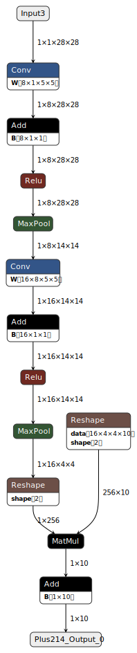
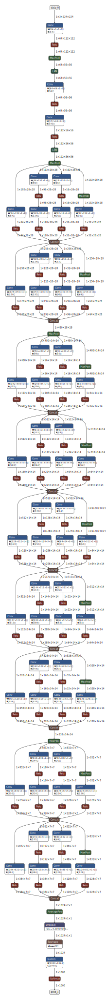

# Group27

## Progetto 2.1 - Configurazione ed esecuzione ottimizzata di una rete neurale generica descritta con standard ONNX

### Build & Run (Rust)

```shell
# Build
cargo build --release

# Run
./target/release/onnx-rust <model> --input <input_file> [--output <output_file>]
```
* `model`: Modello in formato .onnx da leggere
* `input_file`: Dati in ingresso al modello in formato .pb
* `output_file`: Eventuali dati di output attesi in formato .pb, stampati insieme all'output effettivo del modello

### Build & Run (Python)

```shell
# Build
python/build.sh

# Run (virtual environment)
source .env/bin/activate
python python/test.py
```

La libreria compilata si trova in `target/wheels`.

### Modelli scelti

<table>
    <thead>
        <tr align="center">
            <td><strong><a href="https://github.com/onnx/models/tree/main/vision/classification/mnist">MNIST-12</a></strong></td>
            <td><strong><a href="https://github.com/onnx/models/tree/main/vision/classification/inception_and_googlenet/googlenet">GoogLeNet-12</a></strong></td>
        </tr>
    </thead>
    <tbody>
        <tr align="center">
            <td width="500px"></td>
            <td width="500px"></td>
        </tr>
    </tbody>
</table>